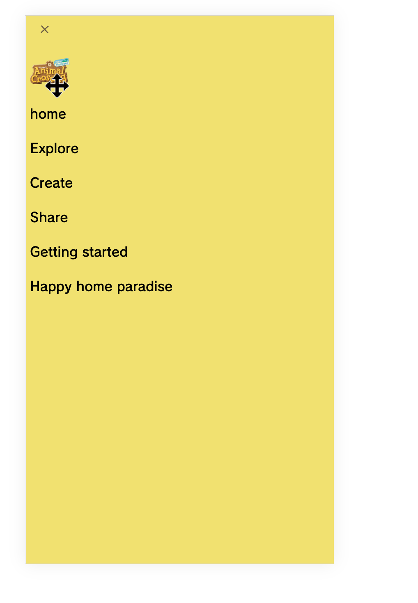

# Procesverslag
Markdown is een simpele manier om HTML te schrijven.  
Markdown cheat cheet: [Hulp bij het schrijven van Markdown](https://github.com/adam-p/markdown-here/wiki/Markdown-Cheatsheet).

Nb. De standaardstructuur en de spartaanse opmaak van de README.md zijn helemaal prima. Het gaat om de inhoud van je procesverslag. Besteedt de tijd voor pracht en praal aan je website.

Nb. Door *open* toe te voegen aan een *details* element kun je deze standaard open zetten. Fijn om dat steeds voor de relevante stuk(ken) te doen.

## Jij

  
uitwerken voor kick-off werkgroep

  ### Auteur:
Felicia Augustine 

  #### Je startniveau:
Blauwe piste 

  #### Je focus:
Surface

## Je website

  
uitwerken voor kick-off werkgroep

  ### Je opdracht:
  link naar de website die je gaat namaken óf de naam/omschrijving van je eigen ontwerp
https://animalcrossing.nintendo.com/new-horizons/explore/

  #### Screenshot(s) van de eerste pagina (small screen): 
Explore
  

  #### Screenshot(s) van de tweede pagina (small screen):
Home 
  
 

## Toegankelijkheidstest 1/2 (week 1)

  
uitwerken na test in 2e werkgroep

  ### Bevindingen
  Lijst met je bevindingen die in de test naar voren kwamen:
  kleurenblindheid (geel)
- De tekst en plaatjes zijn nog duidelijk te zien, de kleuren wijken wel af van het orgineel. 
Combined loss diabetic eye disease 
- Het is lastig om tekst te lezen, vooral de kleine teksten zin lastig.
- Omdat veel dingen dichtbij elkaar staan kun je ze moeilijk zien. 

Screenreader test
- Bij de links geeft het bij buy now en learn more niet aan wat je kan leren of kopen.
- het geeft niet aan waar je naar toe gaat op de homepage.
- bepaalde link naar andere websites hebben geen goede beschrijving.

- de pagina kondigt de video op de homepage niet aan en heeft geen discriptie

## Breakdownschets (week 1)

  
uitwerken na afloop 3e werkgroep

  ### de hele pagina: 
  

## Voortgang 1 (week 2)

  
uitwerken voor 1e voortgang

  ### Stand van zaken
  hier dit ging goed & dit was lastig (neem ook screenshots op van delen van je website en code)

  Ik heb vorige week mijn html skelet gemaakt (alle plaatjes, tekst etc. zitten er in ik moet alleen nog de videos er inzetten.). Deze week ben ik bezig geweest met de start van de opmaak. 
  - Ik heb alle h1,h2 en p's een kleur gegeven met css variables
  - Ik het het overgrootte gedeelte van de navigatie bar gemaakt.

  ### Agenda voor meeting
  samen met je groepje opstellen

  | Felicia     | student 2          | student 3    | student 4        |
  | ---            | ---                | ---          | ---              |
  | vragen over    | en dit             | en ik dit    | en dan ik dat    |
  | gebruik van  | dit als er tijd is | nog een punt | dit wil ik zeker |
  | ...            | ...                | ...          | ...              |

Felicia
-Vragen over gebruik van h1,h2,h3. er zijn bepaalde stukjes in de tekst waar het niet helemaal duidelijk is of het een h2 of h3 moet zijn.
-Moet ik ook zelf dingen toevoegen of moet ik alleen de pagina na coderen?
-hoe programeer ik dat items na 1s tevoorschijn komen?

  ### Verslag van meeting
  hier na afloop snel de uitkomsten van de meeting vastleggen

  - maak gebruik later van intersect voor die pop up animatie ding
  -je hoeft niet verplicht zelf nog code toe te voegen aan je pagina
  - doe het stap voor stap begin met html
  - die breakdownschets moet nog dynamische delen er in 

## Voortgang 2 (week 3)

  
uitwerken voor 2e voortgang

  ### Stand van zaken
  hier dit ging goed & dit was lastig (neem ook screenshots op van delen van je website en code)
  ik ben niet heel veel verder gekomen deze week. Ik ben nu bezig met het maken van een image slider, maar dit is vrij lastig. Ook wil ik nog de videos in mijn website zetten want dit heb ik ook nog niet gedaan.

  ### Agenda voor meeting
  samen met je groepje opstellen

  | student 1      | student 2          | student 3    | student 4        |
  | ---            | ---                | ---          | ---              |
  | dit bespreken  | en dit             | en ik dit    | en dan ik dat    |
  | en dat ook nog | dit als er tijd is | nog een punt | dit wil ik zeker |
  | ...            | ...                | ...          | ...              |

felicia:
- Hoe maak ik een imageslider...
- Hoe krijg ik de background image van de site ACNH met het bewegende beeld...
- Hoe zorg ik dat mijn videos correct werken in html zonder dat het andere elemeten weghaalt
- kan ik de sections wel gebruiken aangezien niet in alle sections een directe h2 is?

  ### Verslag van meeting
  hier na afloop snel de uitkomsten van de meeting vastleggen

  - punt 1
  - punt 2
  - nog een punt
- ...

## Toegankelijkheidstest 2/2 (week 4)

  
uitwerken na test in 9e werkgroep

  ### Bevindingen
  Lijst met je bevindingen die in de test naar voren kwamen (geef ook aan wat er verbeterd is):

## Voortgang 3 (week 4)

  
uitwerken voor 3e voortgang

  ### Stand van zaken
  hier dit ging goed & dit was lastig (neem ook screenshots op van delen van je website en code)

  ### Agenda voor meeting
  samen met je groepje opstellen

  | student 1      | student 2          | student 3    | student 4        |
  | ---            | ---                | ---          | ---              |
  | dit bespreken  | en dit             | en ik dit    | en dan ik dat    |
  | en dat ook nog | dit als er tijd is | nog een punt | dit wil ik zeker |
  | ...            | ...                | ...          | ...              |

  ### Verslag van meeting
  hier na afloop snel de uitkomsten van de meeting vastleggen

  - punt 1
  - punt 2
  - nog een punt
  - ...

## Eindgesprek (week 5)

  
uitwerken voor eindgesprek

  ### Je uitkomst - karakteristiek screenshots:
  

  ### Dit ging goed/Heb ik geleerd: 
  Korte omschrijving met plaatjes

  

  ### Dit was lastig/Is niet gelukt:
  Korte omschrijving met plaatjes

  

## Bronnenlijst

  
continu bijhouden terwijl je werkt

  Nb. Wees specifiek ('css-tricks' als bron is bijv. niet specifiek genoeg). 
  Nb. ChatGpT en andere AI horen er ook bij.
  Nb. Vermeld de bronnen ook in je code.

  1. bron 1
  2. bron 2
  3. ...

  Bron images:
  https://animalcrossing.nintendo.com/new-horizons/explore/

  bronnen code:

  https://developer.mozilla.org/en-US/docs/Web/CSS/Attribute_selectors

  dropshadows
  https://developer.mozilla.org/en-US/docs/Web/CSS/filter-function/drop-shadow

  dit stukje code:    -webkit-font-smoothing: antialiased; 
  = van https://animalcrossing.nintendo.com/new-horizons/explore/
  hierbij worden de gekartelde randen van rondingen en diagonale lijnen verzacht zodat het er beter uit ziet.

  bronnen fonts: 
  https://fonts.google.com/specimen/Libre+Franklin?query=libre+franklin
  https://fonts.google.com/specimen/Zilla+Slab

